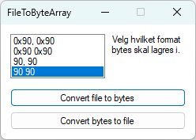

## FileToByteArray  

Et lite program for å dumpe filer i rene bytes.  

 

Dette kan være nyttig f.eks. hvis man skal inkludere ting som DLL biblioteker, 
små databasefiler e.l. i en enkelt kompilert exe/eksekverbar fil hvor man da 
lagrer resultat fra dette programmet i en matrise e.l. i kildekoden før kompilering 
og dumper det ut igjen til en fil et sted ved behov i f.eks. appdata, programdata 
eller et sted i brukerprofilen og tar det videre derfra. Et litt sært behov, 
men jeg hadde det så nå finnes det...  